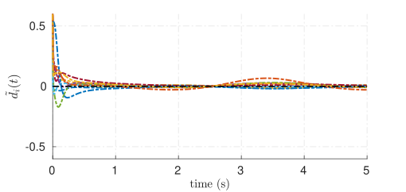
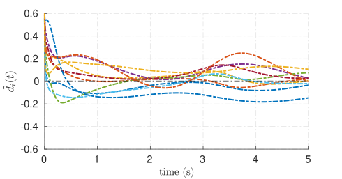

# Estimating External Disturbance for Social Networks Using Concurrent Learning

**Author:** ***Zengjie Zhang*** (z.zhang3@tue.nl)

A benchmark using concurrent learning to estimate external disturbance for a social network. It is complementary to the following publication,

**Zhang, Zengjie, Fangzhou Liu, Tong Liu, Jianbin Qiu, and Martin Buss. "A Persistent-Excitation-Free Method for System Disturbance Estimation Using Concurrent Learning." IEEE Transactions on Circuits and Systems I: Regular Papers 70, no. 8 (2023): 3305-3315.**

## Introduction

Concurrent learning (CL) is an effective approach for the adaptive control of dynamic systems with unknown parameters. CL allows the the control and parameter identification to be conducted simultaneously, ensuring asymptotic convergence of both system states and parameter estimation errors. Utilizing online data, CL can be used for systems which do not satisfy persistent excitation (PE).

The epidemic process over a social network can be recognize a dynamic system that may not satisfy the PE condition. A typical social network is illustrated in **Fig. 1** which describes the friendship relations between $67$ boys in a small high school in Illinois, the U.S. [1]. The epistemic process in a such social network can be represented as a nonlinear dynamic model with the infection probability of each individual serving the state of each node and the curing rate as a control input [2]. Meanwhile, the epistemic process is disturbed by an unknown susceptible rate. In a epidemic control process, the authorities should take measures to bring down the infection probability of all nodes by regulating the curing rates. If the susceptible rate as disturbance can be precisely estimated, the control objective can be achieved more efficiently.

**Figure 1. An example of social network.**

[1] Bonacich, Phillip, and Philip Lu. Introduction to mathematical sociology. Princeton University Press, 2012.

[2] Liu, Fangzhou, Zengjie Zhang, and Martin Buss. "Robust optimal control of deterministic information epidemics with noisy transition rates." Physica A: Statistical Mechanics and its Applications 517 (2019): 577-587.

### Approach

The epidemic dynamic model mentioned above may not satisfy the PE condition when the infection probability is either too high (close to $1$) or too low (close to $0$). In either condition, using the conventional disturbance estimation methods may lead to large estimation errors. In this benchmark, we use CL to estimated the susceptible rate, ensuring a low error bound. **Fig. 2** clearly shows that the proposed CL-based method outperforms the conventional method with smaller estimation errors.

**Figure 2. The comparison of the estimation errors between the proposed CL-based method (left) and a conventional disturbance estimation method (right).**

## File Structure

The files of this benchmark are organized as follows

- `README.md`: this read-me file;
- `init.m`: the initialization script file;
- `data/`: the folder with data;
- `src/`: essential script files;
- `exp_0/`: scripts for experiment 0 (visualize the infection rates and the infection probabilities);
- `exp_1/`: scripts for experiment 1 (compare the disturbance estimation results between two methods);
- `exp_2/`: scripts for experiment 2 (visualize the disturbance compensation control);
- `figs/`: the folder with figures.

### The experiment parameters

Load the `param.mat` file to pull the parameters

- $\bar{d}$, `d_bar`: the parameter used to generate the sinusoidal infection rates
- $\bar{\delta}$, `delta_bar`: the baseline curing rates
- $W$, `W`: the adjacency matrix of the network
- $\Lambda$, `Lambda`: the parameter of the disturbance model
- $x(0)$, `x0`: the initial condition of the system

## Requirement

This benchmark is fully in `.m` scripts and does not have specific version requirements for MATLAB and operating systems.

## Quick Run

### 1. Initialize the environment

Add necessary paths by running `init.m`.

### 2. Run experiment 0: visualize the infection rates and the infection probabilities

Basic epidemic model controled by baseline curing rates $\bar{\delta}$:

- This experiment requires data file `data/param.mat`;
- Run the script `exp_0_generate_data.m` to generate `exp_0_data.mat`; You can also skip this step and use the existing file `exp_0_data.mat`;
- Then, run the script `exp_0_draw_disturbance.m` to plot the disturbance;
- Then, run the script `exp_0_draw_states.m` to plot the states.

### 3. Run experiment 1: compare the disturbance estimation results between two methods

Disturbace observation using CL-based and the conventional observers:

- This experiment requires data files `data/param.mat` and `exp_0_data.mat`;
- Run the script `exp_1_infection_rate_estimation.m` to generate data `exp_1_data.mat`; You can also skip this step and use the existing file `exp_1_data.mat`;
- Then, run the script `exp_1_draw_disturbance_error.m` to plot the estimation errors.

### 4. Run experiment 2: visualize the disturbance compensation control

Disturbance compensation control:

- This experiment requires data files `data/param.mat` and `exp_0_data.mat`;
- Run the script `exp_2_compensation_control.m` to generate data `exp_2_data.mat`; You can also skip this step and use the existing file `exp_2_data.mat`;
- Then, run the script `exp_2_draw_controller.m` to plot the result.

## License

This project is with a BSD-3 license, refer to `LICENSE` for details.